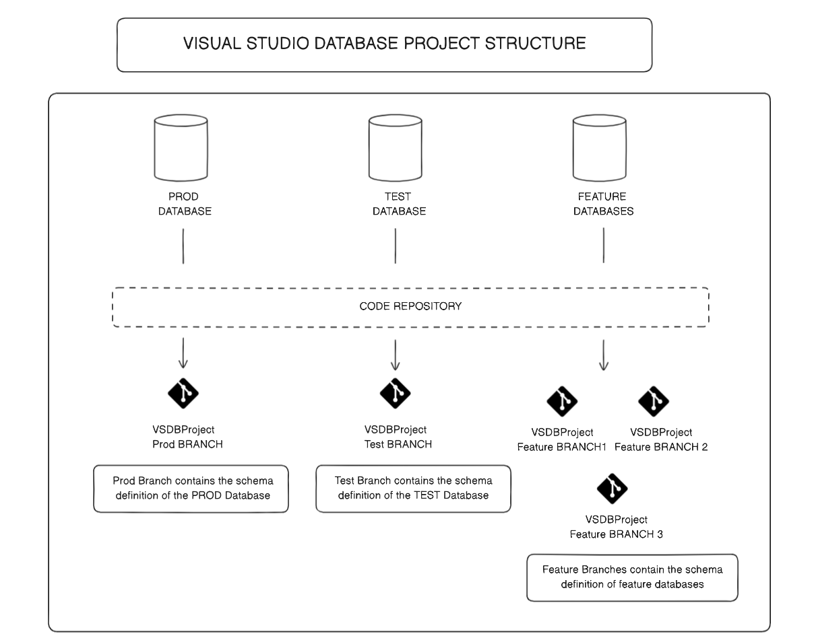
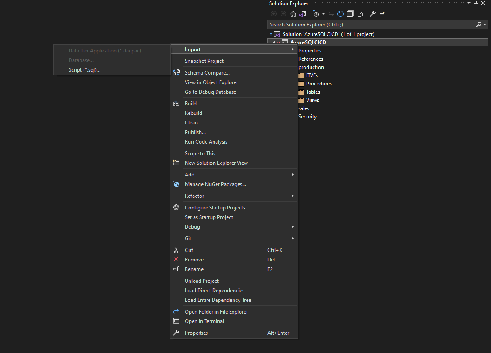
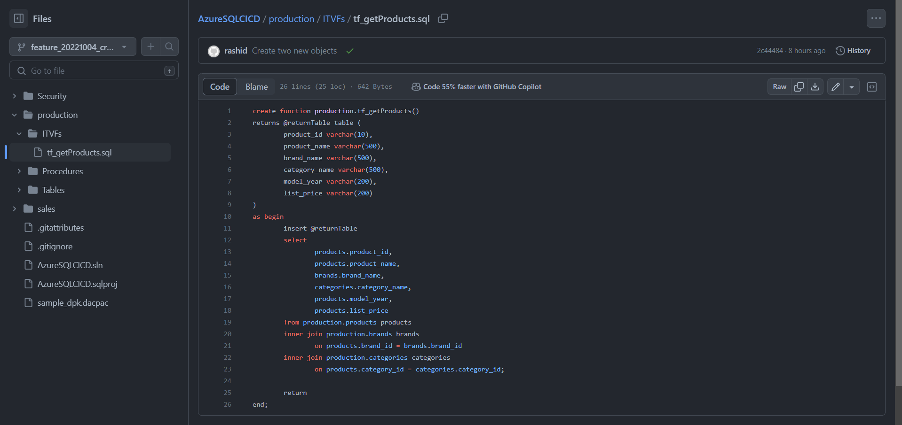

# Azure SQL CI/CD PoC

The goal of this post is to develop a CICD process for *Azure SQL* or *SQL Server* database projects using **Visual Studio** and to discuss the management of VSDB Projects.

# Tools and Requirements
- Visual Studio
- SQL Server Express Edition
- Docker
- SQL Authentication must be enabled on DB Servers.
- Basic understanding of version control using `git`
- Basic understanding of shell scripting


# Notes
To use `sqlpackage` with git bash on windows, you'll need to run git bash as an administrator. 

# Basic Architecture of a database


Figure 1: *Basic architecture of a database*


# Visual Studio Database Project (VSDB) Management

A **visual studio database project** is a special type of visual studio `.NET` project. Its purpose is to create and manage SQL database scripts. In this case, it will be used to manage the *metadata* of a database. In the following sections, we'll learn how to manage VSDB projects and understand how `*.dacpac` files work.

 

Figure 2: *Proposed VSDB Project Structure*

In the proposed VSDB project structure, the project is managed with a single repository. The repository will mainly consist of the following branches

- `Prod`
- `Test`
- `Feature`


Figure 3: *Code Repository*

The `Prod` branch keeps track of the PROD DB metadata, `Test` keeps track of the TEST DB metadata, and `Feature` keeps track of the feature database metadata. Typically, there will be one PROD DB, one TEST DB, and several FEATURE DBs. The feature DBs will be hosted locally on the developers machine using tools like *Docker* or *SQL Server Express Edition*. They will be used for experimentation and prototyping prior to the addition of new objects to the PROD DB.

In the following sections, we'll take a deep dive into how we can manage VSDB projects. We'll start by setting up our environment.

## Step 1: Download SQL Server Express Edition

We'll be using docker to start SQL Server Express Edition. Alternatively, you can download the SQL Server Express Edition from [here](https://www.microsoft.com/en-au/sql-server/sql-server-downloads). 

This will be used to host your local/feature databases. For the sake of this tutorial, the production database will also be hosted on the server.

```bash
docker pull mcr.microsoft.com/mssql/server:2022-latest
```

### Start the server

If you're running SQL Server with docker then start the server with the following command.

```bash
# Server 1
docker run -e "ACCEPT_EULA=Y" -e "MSSQL_SA_PASSWORD=yourStrong(!)Password" -p 1434:1433 -d mcr.microsoft.com/mssql/server:2022-latest
```

<br/>

## Step 2: Install SQLPackage

[SqlPackage](https://learn.microsoft.com/en-us/sql/tools/sqlpackage/sqlpackage?view=sql-server-ver16) is a command-line utility that automates database development tasks by exposing some of the public Data-Tier Application Framework (DacFx) APIs. We'll be installing *SQLPackage* with `dotnet`.

### Option 1: On Ubuntu

```bash
docker pull ubuntu:latest
```

**Start the container**
```bash
docker run -d ubuntu bash -c "tail -f /dev/null"
```

**Exec into ubuntu container**

`Exec` into the ubuntu container and install `sqlpackage` with `dotnet`. 

```bash 
# Install dotnet
sudo apt-get update 
sudo apt-get install -y dotnet-sdk-7.0

# Install sqlpackage
dotnet tool install -g microsoft.sqlpackage
```

### Option 2: On Windows
Go [here](https://learn.microsoft.com/en-us/dotnet/core/install/windows?tabs=net70) to learn how to install `dotnet` on windows.

```bash 
dotnet tool install -g microsoft.sqlpackage
```

<br/>

# Create objects on the SQL Server

Run the `Scripts/restoreDB/restore_db.sql` script to create a sample production database - `productionDB`.

<br/>

# Getting ready to add features

Let's add some features to our production database.

## Step 1: Create a visual studio project

1. Open Visual Studio.
2. Under the **Get started** section, click on *Create a new project*.
3. Use the *SQL Server Database Project* template. In the search bar, type *query* to find the template and click on *Next*.

    

    Figure 4: *Create a new Visual Studio Database Project* 
    
    <br/>

4. Provide a project name in the project configuration and click on *Create*. In this tutorial, **AzureSQLCICD** is the project name.

    

    Figure 5: *Configure the project*

    <br/>

## Step 2: Import `productionDB` schema 
1. In the Solution Explorer, right-click on the project, select import, and click on *Database*.

    

    Figure 6: *Import the productionDB schema*

    <br/>

2. Set up the connection to the database and click on *Connect*.
    
    

    Figure 7: *Connection to the production database*

    <br/>

3. Click on *Start* to commence the database import.

    

    Figure 8: *Commence database import*

    <br/>

3. Upon successful completion, all the `productionDB` objects are displayed in the solution explorer.

    

    Figure 9: *Production DB Schema objects*

<br/>

## Step 3: Publish project to a git repo
The `productionDB` schema is now available in the Visual Studio Project. Before we add some new features to the `productionDB` schema, let's push the schema to a remote.

1. In the solution explorer, click on *Git Changes* at the bottom of the screen. 
2. Create a `git` repo 
3. Push the local changes to the remote. The repo name is **AzureSQLCICD**.

    

    Figure 10: *Create git repository*

<br/>

## Step 4: Create a new feature: ITVF
Create new ITVF in the `production` schema.

1. Right-click on the `production` folder, click on *Add*, and then click on *New Folder*. Name the folder as *ITVF* (you can also use any name).

    

    Figure 11: *Create a new folder in Production schema*

    <br/>

2. In the `ITVF` folder, create a file called `tf_getProducts.sql`. Paste the following code in the file.

    

    Figure 12: *New folder in production schema*

    <br/>

    ```sql
    create function production.tf_getProducts()
    returns @returnTable table (
        product_id varchar(10),
        product_name varchar(500),
        brand_name varchar(500),
        category_name varchar(500),
        model_year varchar(200),
        list_price varchar(200)
    )
    as begin
        insert @returnTable
            select 
                products.product_id,
                products.product_name,
                brands.brand_name,
                categories.category_name,
                products.model_year,
                products.list_price
            from production.products products
            inner join production.brands brands
                on products.brand_id = brands.brand_id
            inner join production.categories categories 
                on products.category_id = categories.category_id;

        return
    end;
    ```

## Step 5: Publish the new feature to a feature branch in the git repo.



Figure 13: *New feature branch*

<br/>
<br/>


# New Developer: Restoring VSDB Project from remote
1. Clone the repo from the remote.
    ```
    git clone git@github.com:RashidCodes/Azure-SQL-CICD.git
    ```

2. Open Visual Studio.
3. Click on `File`, click on `Open`, and click on `Folder`.

    

    Figure 14: *New developer folder*

    <br/>

4. Select the project folder; `AzureSQLCICD`.
5. Right-click on the `*.sln` file and click on *Open*.

    

    Figure 15: *Open solution file*

    <br/>

The new developer can now add features to the project.


<br/>
<br/>

# How to create new features

The first step in creating a new feature is the creation of a *local feature database*. This database will be used for prototyping/experimentation. See the `setup/create_local_env` directory for more details.

Depending on the feature, the developer may or may not need **data**. For e.g. the creation of a *sequence* object does not require data whereas the creation of a *view* does. Where data is required, a `*.dacpac` file containing the production database (`productionDB`) **metadata** and **data** from selected tables has to be created and deployed to the feature database. If the creation of the feature does not require data, then visual studio can be used to publish the production database metadata to the feature database.

In the following sections, we'll learn how to create `*.dacpac` files and publish them to a feature database.

## What is a DACPAC?

A DACPAC - Data Tier Application Package is a zip file that contains a data model (database objects). A `*.dacpac` file may contain database metadata only or database metadata and database data.


Figure 16: *Composition of a dacpac file*

## Create a DACPAC with data from specific tables (recommended)
In the instance where a developer needs to make changes to a stored procedure, view, etc. that uses a particular table, this command can be used.

```bash
sqlpackage /Action:Extract /TargetFile:sample_dpk.dacpac /DiagnosticsFile:sample_dpk_log.log /p:TableData='Person.Person' /p:VerifyExtraction=true /SourceServerName:host.docker.internal,1434 /SourceDatabaseName:${DATABASE} /SourceUser:sa /SourcePassword:sqlserver_password@3212 /sec:False

# Windows CMD
sqlpackage /Action:Extract /TargetFile:"C:\Users\user\source\repos\Azure-SQL-CICD\sample_dpk.dacpac" /DiagnosticsFile:"C:\Users\user\source\repos\Azure-SQL-CICD\sample_dpk_log.log" /p:TableData='Person.Person' /p:VerifyExtraction=true /SourceServerName:localhost,1434 /SourceDatabaseName:${DATABASE} /SourceUser:sa /SourcePassword:sqlserver_password@3212 /sec:False
```

## Create a schema-only DACPAC 

```bash
#!/bin/bash
DATABASE="sample-database"
SERVER_NAME="rashid-is-awesome.database.windows.net"
SOURCE_USER="the-best-sql-adminstrator"
PASSWORD=""

# Extract the schema from the whole db
sqlpackage /Action:Extract /TargetFile:sample_dpk.dacpac /DiagnosticsFile:sample_dpk_log.log /p:VerifyExtraction=true  /SourceServerName:${SERVER_NAME} /SourceDatabaseName:${DATABASE} /SourceUser:${SOURCE_USER} /SourcePassword:${PASSWORD} /sec:False;

```

```bash
# Windows CMD
sqlpackage /Action:Extract /TargetFile:"C:\Users\user\source\repos\Azure-SQL-CICD\sample_dpk.dacpac" /DiagnosticsFile:"C:\Users\user\source\repos\Azure-SQL-CICD\sample_dpk_log.log" /SourceConnectionString:"Server=localhost,1434;Initial Catalog=productionDB;User ID=sa;Password=yourStrong(!)Password;MultipleActiveResultSets=False;Encrypt=True;TrustServerCertificate=True;Connection Timeout=30;
```

## Create a DACPAC with data from all tables (not recommended)
```bash
#/bin/bash
DATABASE="sample_database"

# Extract source db schema and data
sqlpackage /Action:Extract /TargetFile:sample_dpk.dacpac /DiagnosticsFile:sample_dpk_log.log /p:ExtractAllTableData=true /p:VerifyExtraction=true /SourceServerName:localhost,1434 /SourceDatabaseName:${DATABASE} /SourceUser:sa /SourcePassword:sqlserver_password@3212 /sec:False

# Windows CMD
sqlpackage /Action:Extract /TargetFile:"C:\Users\user\source\repos\Azure-SQL-CICD\sample_dpk.dacpac" /DiagnosticsFile:"C:\Users\user\source\repos\Azure-SQL-CICD\sample_dpk_log.log" /p:ExtractAllTableData=true /p:VerifyExtraction=true /SourceServerName:localhost,1434 /SourceDatabaseName:${DATABASE} /SourceUser:sa /SourcePassword:sqlserver_password@3212 /sec:False
```

## Publish the DACPAC
```bash
# Windows CMD
sqlpackage /Action:Publish /SourceFile:"C:\Users\user\source\repos\Azure-SQL-CICD\sample_dpk.dacpac" /TargetConnectionString:'Server=tcp:localhost,1434;Initial Catalog=${DATABASE};User ID=sa Password="sqlserver_password@3212";Encrypt=False;TrustServerCertificate=False;Connection Timeout=30;';
```

**Inspect destination server to make sure the Database and it's objects were created. The `*.dacpac` file can be deployed to a feature database for development.**

<br/>
<br/>

# Feature Creation: Create a new view called `vw_productView`

Now that we've learned how to create a `*.dacpac` file, let's learn how to create a new feature. Make sure you have the `productionDB` database project open in Visual Studio.

## Step 1

Inspect the `Scripts/setup/create_local_env` directory to learn how to publish prod metadata and data to a local feature database.

## Step 2
After some experimentation in the `feature_20221004_create_some_view` database, here's the code for the view

```sql
create view [production].[vw_productView]
as 
select 
    products.product_id,
    products.product_name,
    brands.brand_name,
    categories.category_name,
    products.model_year,
    products.list_price
from production.products products
inner join production.brands brands
    on products.brand_id = brands.brand_id
inner join production.categories categories 
    on products.category_id = categories.category_id;
```

# Step 3
The view has been created in the `feature_20221004_create_some_view` database. We can now use the schema comparison tool in VS to compare the schema of the feature database and the production database.

1. In Visual Studio, click on *Tools*, select *SQL Server*, and select *New Schema Comparison*.

    

    Figure 17: *Schema comparison*

2. Select a source.

    

    Figure 18: *Select source*

3. Click on the Database radio button and click on *Select Connection...*.

    

    Figure 19: *Select source db connection*


4. Click on the feature database - `feature_20221004_create_some_view` and click on *Connect*.

5. Select a target.

    

    Figure 20: *Select target*

6. Click on the *Project* radio button. In the drop menu below, select your project and click on *OK*.

    

    Figure 21: *Final schema comparison*

7. Click on *Compare*

8. Inspect the new changes and click on the *Update* button to update the AzureSQLCICD VS Project to include the new view created in the feature database.

    

    Figure 22: *Schema comparison window*

3. We can now see the view definition in the productionDB schema (in the solution explorer)

    

    Figure 23: *New product view*

4. We are now ready to push our local changes to the metadata to a remote feature branch.


<br/>

# Conceptual Pipelines

## Deployment to UAT DB using UAT branch


Figure 24: *Deployment to UAT DB by merging a feature branch to the UAT branch*


## Deployment to Prod DB using PROD branch


Figure 25: *Deployment to Prod DB by merging UAT branch to PROD branch*

## Deployment to Test DB from a Feature DB


Figure 26: *Direct deployment to Test DB from Feature DB*

## Cross DB replication


Figure 27: *Passwordless Cross DB Replication*

<br/>
<br/>

# Questions

## What happens when data loss occurs?
The build fails unless the `BlockOnPossibleDataLoss` parameter is set to `false`

```bash
sqlpackage /Action:Publish /SourceFile:sample_dpk.dacpac /TargetConnectionString:'Server=tcp:host.docker.internal,1435;Initial Catalog=sample_database;User ID=sa;Password="sqlserver_password@3212";Encrypt=False;TrustServerCertificate=False;Connection Timeout=30;' /p:BlockOnPossibleDataLoss=false;
```

## What happens if a new deployment of an object is erroneous?
The build fails; the object definition MUST be corrected.

## Can we exclude the deployment of certain object types?
Object types can be excluded by setting the `ExcludeObjectTypes` parameter.
```bash
sqlpackage /Action:Publish /SourceFile:sample_dpk.dacpac /TargetConnectionString:'Server=tcp:host.docker.internal,1435;Initial Catalog=sample_database;User ID=sa;Password="sqlserver_password@3212";Encrypt=False;TrustServerCertificate=False;Connection Timeout=30;' /p:BlockOnPossibleDataLoss=false /p:ExcludeObjectType='ScalarValuedFunctions,SearchPropertyLists';
```

## Can you deploy a dacpac build from azure sql to sql-sever?
Yes, you can deploy a dacpac built from azure sql to sql server 2022.


<br/>
<br/>

# References
## Kevin Chant
https://github.com/kevchant/AzureDevOps-AzureSQLDatabase

## SqlPackage
https://learn.microsoft.com/en-us/sql/tools/sqlpackage/sqlpackage?view=sql-server-ver16

## Create DACPAC from SQL Server Database
https://azureops.org/articles/dacpac-sql-server-database/

## Download and install SqlPackage
https://learn.microsoft.com/en-us/sql/tools/sqlpackage/sqlpackage-download?view=sql-server-ver16

## Restore an AdventureWorks Sample DB
https://learn.microsoft.com/en-us/sql/samples/adventureworks-install-configure?view=sql-server-ver15&tabs=ssms#deploy-to-azure-sql-database

## Resource Limitations per region
https://dev.to/omiossec/using-azure-container-instance-with-multiple-containers-43fd
